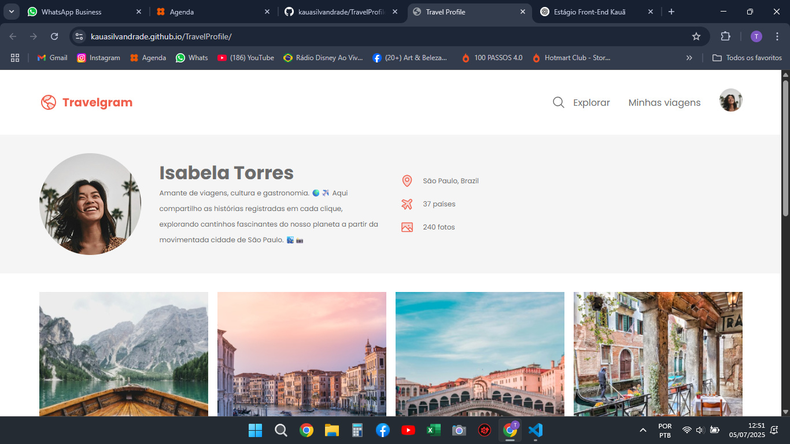

# ✈️ Perfil de Viagem - Rocketseat Challenge

Este projeto foi desenvolvido como parte de um desafio do curso Fullstack da Rocketseat.  
A proposta foi criar uma página pessoal de perfil com o tema "viagem", utilizando HTML e CSS, com foco em estrutura semântica, organização e visual atrativo.

## 📚 Descrição do projeto

A página contém:

- Nome e imagem do viajante
- Descrição pessoal e interesses
- Locais visitados ou desejados
- Estilização com tema visual leve e organizado

## 💻 Tecnologias utilizadas

- HTML5  
- CSS3  
- Flexbox  
- Tipografia e cores personalizadas

## 🌐 Acesse o projeto online

🔗 [Clique aqui para ver o site publicado](https://kauasilvandrade.github.io/TravelProfile)

## 📸 Imagem do projeto

## 📌 Status do projeto

✅ Projeto finalizado e publicado.

## ✍️ Autor

**Kauã da Silva Andrade**  
[LinkedIn](https://www.linkedin.com/in/kauã-andrade-6440a9225)  
[GitHub](https://github.com/kauasilvandrade)
